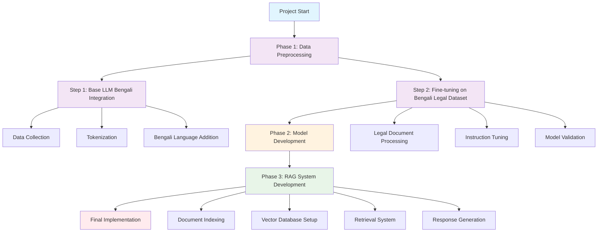
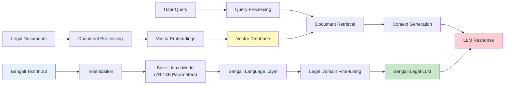
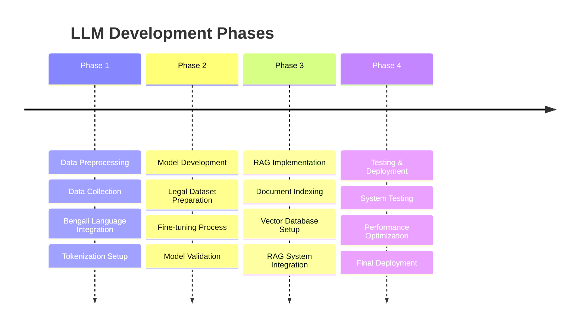

# Bengali Legal LLM Development Work Plan Report

## Executive Summary

This report outlines a comprehensive work plan for developing a specialized Large Language Model (LLM) for Bengali legal document processing. The project aims to create an intelligent system capable of understanding, processing, and responding to legal queries in Bengali by fine-tuning Meta's Llama model and implementing a Retrieval-Augmented Generation (RAG) system.

## Table of Contents

1. [Project Overview](#project-overview)
2. [LLM Size Requirements for Legal Documents](#llm-size-requirements)
3. [Technical Architecture](#technical-architecture)
4. [Phase-by-Phase Implementation Plan](#implementation-plan)
5. [Resource Requirements](#resource-requirements)
6. [Timeline and Milestones](#timeline-milestones)
7. [Risk Assessment and Mitigation](#risk-assessment)
8. [Success Metrics](#success-metrics)
9. [Budget Estimation](#budget-estimation)
10. [Conclusion](#conclusion)

## Project Overview

### Objectives
- Develop a Bengali-capable legal LLM based on Llama architecture
- Create a comprehensive legal document processing system
- Implement RAG for enhanced accuracy and context-awareness
- Provide accessible legal assistance in Bengali language

### Key Components
- **Base Model**: Meta's Llama 2/3 series
- **Domain**: Legal document processing in Bengali
- **Technology Stack**: PyTorch, Transformers, LangChain, Vector Databases
- **Deployment**: Cloud-based scalable infrastructure

## LLM Size Requirements for Legal Documents

### Recommended Model Sizes

Based on research and industry best practices for legal document processing:

#### **7B Parameters (Recommended Minimum)**
- **Memory Requirements**: 14-28 GB VRAM (depending on quantization)
- **Use Case**: Basic legal document understanding and simple Q&A
- **Performance**: Good for straightforward legal queries
- **Cost**: Most cost-effective option

#### **13B Parameters (Optimal Choice)**
- **Memory Requirements**: 26-52 GB VRAM
- **Use Case**: Complex legal reasoning and multi-document analysis
- **Performance**: Excellent balance of capability and efficiency
- **Recommended for**: This project due to Bengali language complexity

#### **70B Parameters (Advanced Option)**
- **Memory Requirements**: 140+ GB VRAM (multi-GPU setup required)
- **Use Case**: Highly complex legal analysis and precedent research
- **Performance**: State-of-the-art but resource-intensive

### **Final Recommendation: Llama 2/3 13B**
For Bengali legal document processing, we recommend the **13B parameter model** as it provides:
- Sufficient capacity for legal domain knowledge
- Better handling of Bengali language nuances
- Reasonable computational requirements
- Good fine-tuning capabilities

## Technical Architecture

### System Overview



### Data Flow Architecture



## Phase-by-Phase Implementation Plan

### Timeline Overview



### Phase 1: Data Preprocessing (Weeks 1-6)

#### Step 1: Base LLM Bengali Integration (Weeks 1-3)

**1.1 Data Collection**
- **Bengali Legal Corpus**: Collect 50-100GB of Bengali legal texts
  - Constitution of Bangladesh (Bengali translation)
  - Supreme Court judgments
  - High Court decisions  
  - Legal acts and ordinances
  - Legal textbooks and commentaries
- **General Bengali Text**: Additional 200GB for language understanding
  - News articles
  - Literature
  - Academic papers
  - Government documents

**1.2 Tokenization Enhancement**
- Extend Llama tokenizer for Bengali scripts
- Add Bengali-specific tokens (legal terminology)
- Optimize token efficiency for Bengali text
- Target vocabulary size: 100K-150K tokens

**1.3 Infrastructure Setup**
- Set up cloud infrastructure (AWS/Azure/GCP)
- Configure multi-GPU training environment
- Implement data pipeline and preprocessing tools

#### Step 2: Fine-tuning on Bengali Legal Dataset (Weeks 4-6)

**2.1 Legal Document Processing**
- Clean and structure legal documents
- Create question-answer pairs from legal texts
- Implement citation and reference systems
- Quality assurance and validation

**2.2 Instruction Dataset Creation**
- Develop 50K+ instruction-response pairs
- Cover various legal scenarios:
  - Contract analysis
  - Legal advice queries
  - Document summarization
  - Precedent research
  - Rights and obligations explanation

**2.3 Data Validation**
- Legal expert review of dataset
- Accuracy verification
- Cultural and linguistic appropriateness check

### Phase 2: Model Development (Weeks 7-12)

#### 2.1 Base Model Fine-tuning (Weeks 7-9)

**Technical Specifications:**
- **Model**: Llama 2/3 13B
- **Training Method**: LoRA (Low-Rank Adaptation) + Full Fine-tuning
- **Hardware**: 4x A100 80GB GPUs
- **Batch Size**: 32-64 (with gradient accumulation)
- **Learning Rate**: 1e-4 to 5e-5 (with warmup)
- **Training Steps**: 10K-50K steps

**Training Process:**
1. **Phase 2.1a**: Bengali language adaptation (3K steps)
2. **Phase 2.1b**: Legal domain adaptation (7K steps)
3. **Phase 2.1c**: Instruction tuning (15K steps)

#### 2.2 Model Optimization (Weeks 10-11)

**Optimization Techniques:**
- **Quantization**: 8-bit/16-bit precision
- **Knowledge Distillation**: Create smaller efficient models
- **Model Pruning**: Remove redundant parameters
- **Memory Optimization**: Implement efficient attention mechanisms

#### 2.3 Model Validation (Week 12)

**Evaluation Metrics:**
- **BLEU Score**: Translation quality for Bengali
- **Legal Accuracy**: Expert validation of legal responses
- **Perplexity**: Language modeling capability
- **Human Evaluation**: User satisfaction scores

### Phase 3: RAG System Development (Weeks 13-18)

#### 3.1 Document Indexing (Weeks 13-14)

**Vector Database Setup:**
- **Database Choice**: Pinecone, Weaviate, or Chroma
- **Embedding Model**: Bengali-specific sentence transformers
- **Index Size**: 1M+ legal document chunks
- **Chunk Strategy**: 512-1024 tokens per chunk with overlap

**Document Processing Pipeline:**
```python
# Pseudocode for document processing
def process_legal_documents():
    documents = load_bengali_legal_docs()
    chunks = split_documents(documents, chunk_size=512)
    embeddings = generate_embeddings(chunks, model="bengali-legal-bert")
    vector_db.index(chunks, embeddings)
```

#### 3.2 Retrieval System (Weeks 15-16)

**Retrieval Strategy:**
- **Semantic Search**: Vector similarity matching
- **Keyword Search**: BM25 for exact term matching
- **Hybrid Approach**: Combine semantic and keyword search
- **Reranking**: Use cross-encoder for final ranking

**Query Processing:**
- **Query Translation**: Handle English to Bengali queries
- **Query Expansion**: Add synonyms and related terms
- **Intent Classification**: Categorize legal query types

#### 3.3 Response Generation (Weeks 17-18)

**RAG Pipeline:**
1. **Query Analysis**: Understand user intent
2. **Document Retrieval**: Fetch relevant legal documents
3. **Context Preparation**: Prepare retrieved context for LLM
4. **Response Generation**: Generate contextually aware response
5. **Answer Validation**: Ensure legal accuracy and relevance

### Phase 4: Testing and Deployment (Weeks 19-24)

#### 4.1 System Integration Testing (Weeks 19-20)

**Testing Framework:**
- **Unit Tests**: Individual component testing
- **Integration Tests**: End-to-end system testing
- **Performance Tests**: Load and stress testing
- **Accuracy Tests**: Legal expert validation

#### 4.2 User Acceptance Testing (Weeks 21-22)

**Test Scenarios:**
- **Legal Professionals**: Lawyers, paralegals
- **General Public**: Citizens seeking legal information
- **Government Officials**: Administrative law queries
- **Students**: Legal education support

#### 4.3 Deployment (Weeks 23-24)

**Deployment Architecture:**
- **API Gateway**: RESTful API for system access
- **Load Balancer**: Handle multiple concurrent requests
- **Monitoring**: System performance and usage analytics
- **Security**: Data encryption and access controls

## Resource Requirements

### Hardware Requirements

#### Training Infrastructure
- **GPUs**: 4x NVIDIA A100 80GB or 8x V100 32GB
- **CPU**: 64+ cores
- **RAM**: 512GB+ system memory
- **Storage**: 10TB+ NVMe SSD storage
- **Network**: High-speed interconnect for distributed training

#### Inference Infrastructure
- **GPUs**: 2x A100 40GB or 4x RTX 4090
- **CPU**: 32+ cores
- **RAM**: 256GB system memory
- **Storage**: 2TB SSD for model and index storage

### Software Requirements

**Core Technologies:**
- **Python 3.8+**: Primary programming language
- **PyTorch 2.0+**: Deep learning framework
- **Transformers**: Hugging Face library
- **DeepSpeed/FairScale**: Distributed training
- **LangChain**: RAG system development
- **FastAPI**: API development
- **Docker**: Containerization

**Supporting Tools:**
- **Weights & Biases**: Experiment tracking
- **TensorBoard**: Training visualization
- **Jupyter**: Development environment
- **Git**: Version control

### Human Resources

**Core Team (8-10 members):**
- **Project Manager** (1): Overall coordination and timeline management
- **ML Engineers** (3): Model development and fine-tuning
- **Data Engineers** (2): Data pipeline and preprocessing
- **Legal Experts** (2): Domain knowledge and validation
- **DevOps Engineer** (1): Infrastructure and deployment
- **Bengali Linguist** (1): Language and cultural expertise

**Additional Support:**
- **Legal Reviewers** (5-10): Part-time validation and testing
- **UI/UX Designer** (1): User interface development
- **Quality Assurance** (2): Testing and validation

## Timeline and Milestones

### Detailed Timeline (24 Weeks)

| Phase | Duration | Key Deliverables | Success Criteria |
|-------|----------|-----------------|------------------|
| **Phase 1** | Weeks 1-6 | Bengali corpus, Enhanced tokenizer, Instruction dataset | 100GB+ legal corpus, 50K+ QA pairs |
| **Phase 2** | Weeks 7-12 | Fine-tuned model, Optimized inference | >80% legal accuracy, <500ms response time |
| **Phase 3** | Weeks 13-18 | RAG system, Vector database, API | 1M+ indexed documents, <2s retrieval time |
| **Phase 4** | Weeks 19-24 | Production system, User testing, Deployment | 95% uptime, >4.0/5 user satisfaction |

### Critical Milestones

- **Week 3**: Bengali tokenizer ready
- **Week 6**: Legal dataset prepared
- **Week 9**: Base model fine-tuning complete
- **Week 12**: Model validation passed
- **Week 15**: RAG system functional
- **Week 18**: End-to-end system integration
- **Week 21**: User acceptance testing complete
- **Week 24**: Production deployment

## Risk Assessment and Mitigation

### Technical Risks

| Risk | Probability | Impact | Mitigation Strategy |
|------|-------------|--------|-------------------|
| **Model Performance Below Expectations** | Medium | High | Extensive validation, expert review, iterative improvement |
| **Bengali Language Quality Issues** | Medium | Medium | Native speaker validation, linguistic expert consultation |
| **Infrastructure Challenges** | Low | High | Redundant systems, cloud provider backup |
| **Data Quality Problems** | Medium | Medium | Rigorous data cleaning, multiple validation stages |

### Business Risks

| Risk | Probability | Impact | Mitigation Strategy |
|------|-------------|--------|-------------------|
| **Legal Accuracy Concerns** | Medium | High | Legal expert validation, disclaimer systems |
| **Regulatory Compliance** | Low | High | Legal compliance review, data privacy measures |
| **User Adoption Challenges** | Medium | Medium | User-centric design, training programs |
| **Competition** | High | Medium | Unique features, continuous improvement |

### Mitigation Strategies

**1. Quality Assurance**
- Multiple validation stages
- Expert review at each phase
- Continuous testing and improvement

**2. Legal Compliance**
- Regular legal expert consultation
- Compliance with data protection laws
- Clear disclaimers and limitations

**3. Technical Robustness**
- Redundant infrastructure
- Comprehensive testing
- Gradual rollout strategy

## Success Metrics

### Technical Performance Metrics

**Model Quality:**
- **Legal Accuracy**: >85% on expert validation
- **Bengali Language Fluency**: >4.0/5 native speaker rating
- **Response Relevance**: >80% relevance score
- **Factual Correctness**: >90% factual accuracy

**System Performance:**
- **Response Time**: <2 seconds average
- **System Uptime**: >99% availability
- **Throughput**: 100+ concurrent users
- **Scalability**: Handle 10x load increase

### Business Impact Metrics

**User Engagement:**
- **Daily Active Users**: 1000+ within 3 months
- **User Satisfaction**: >4.0/5 rating
- **Query Success Rate**: >85% successful queries
- **User Retention**: >60% monthly retention

**Legal Impact:**
- **Case Study Success**: 10+ documented success stories
- **Expert Endorsements**: 5+ legal expert testimonials
- **Institution Adoption**: 3+ legal institutions using system

## Budget Estimation

### Development Costs (6 months)

| Category | Cost (USD) | Details |
|----------|------------|---------|
| **Personnel** | $180,000 | 8-10 team members for 6 months |
| **Infrastructure** | $60,000 | Cloud computing, GPUs, storage |
| **Software Licenses** | $15,000 | Development tools and services |
| **Legal Consultation** | $25,000 | Expert validation and compliance |
| **Miscellaneous** | $20,000 | Training, travel, contingency |
| **Total** | **$300,000** | Complete development budget |

### Operational Costs (Annual)

| Category | Cost (USD) | Details |
|----------|------------|---------|
| **Infrastructure** | $80,000 | Production hosting and maintenance |
| **Personnel** | $120,000 | 2-3 team members for operations |
| **Model Updates** | $30,000 | Continuous improvement and retraining |
| **Legal Compliance** | $15,000 | Ongoing legal review and updates |
| **Total** | **$245,000** | Annual operational costs |

### ROI Projection

**Revenue Potential:**
- **Subscription Model**: $50/month per professional user
- **API Usage**: $0.10 per query for enterprise
- **Consulting Services**: $200/hour for customization

**Break-even Analysis:**
- **Break-even Point**: 12-18 months
- **Projected 3-year Revenue**: $2-5 million
- **ROI**: 300-500% over 3 years

## Conclusion

This comprehensive work plan outlines the development of a specialized Bengali legal LLM system that will revolutionize legal assistance in Bangladesh. The project combines cutting-edge AI technology with deep domain expertise to create a valuable tool for legal professionals and the general public.

### Key Success Factors

1. **Strong Technical Foundation**: Using proven Llama architecture with appropriate scaling
2. **Domain Expertise**: Legal expert involvement throughout development
3. **Cultural Sensitivity**: Native Bengali speaker input for language accuracy
4. **Iterative Development**: Continuous validation and improvement
5. **Robust Infrastructure**: Scalable and reliable deployment architecture

### Expected Impact

The successful implementation of this system will:
- **Democratize Legal Knowledge**: Make legal information accessible to Bengali speakers
- **Improve Legal Efficiency**: Reduce time and cost of legal research
- **Support Legal Education**: Provide valuable learning resources
- **Enable Innovation**: Create foundation for future legal AI applications

### Next Steps

1. **Secure Funding**: Obtain necessary financial resources
2. **Assemble Team**: Recruit qualified team members
3. **Legal Partnerships**: Establish relationships with legal institutions
4. **Infrastructure Setup**: Prepare development and deployment environments
5. **Project Initiation**: Begin Phase 1 implementation

This project represents a significant opportunity to advance AI applications in the legal domain while serving the Bengali-speaking community. With careful execution of this plan, we can create a transformative tool that bridges the gap between complex legal knowledge and public accessibility.

---

*This report serves as a comprehensive guide for the development of a Bengali legal LLM system. Regular updates and refinements should be made based on project progress and new technological developments.*
